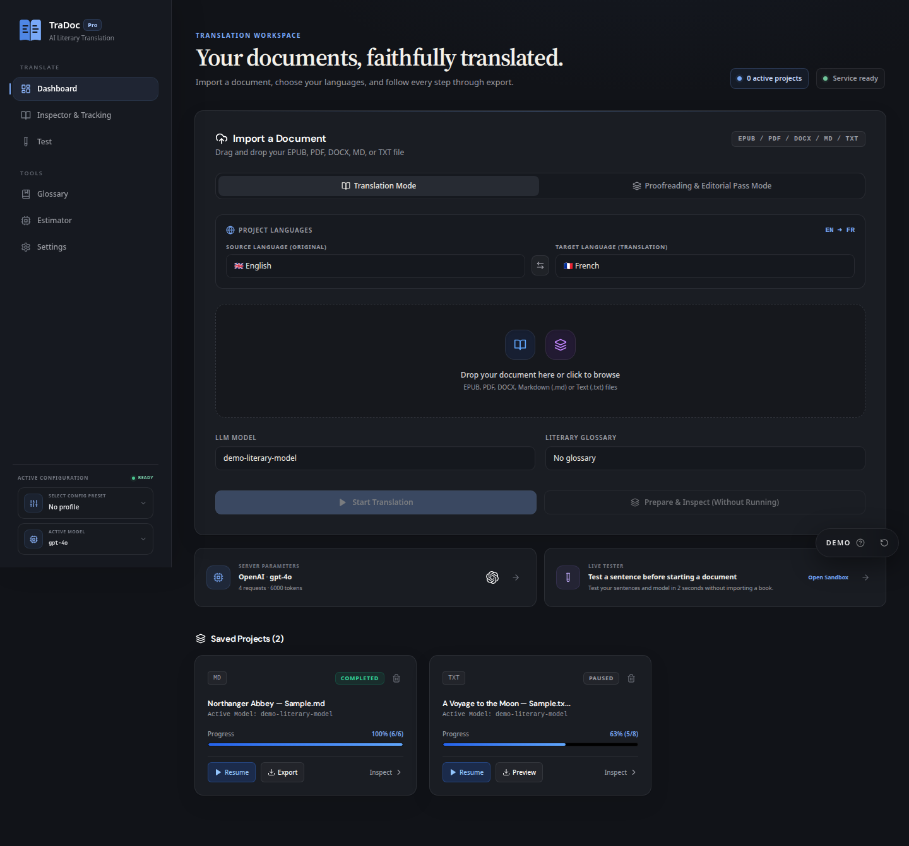
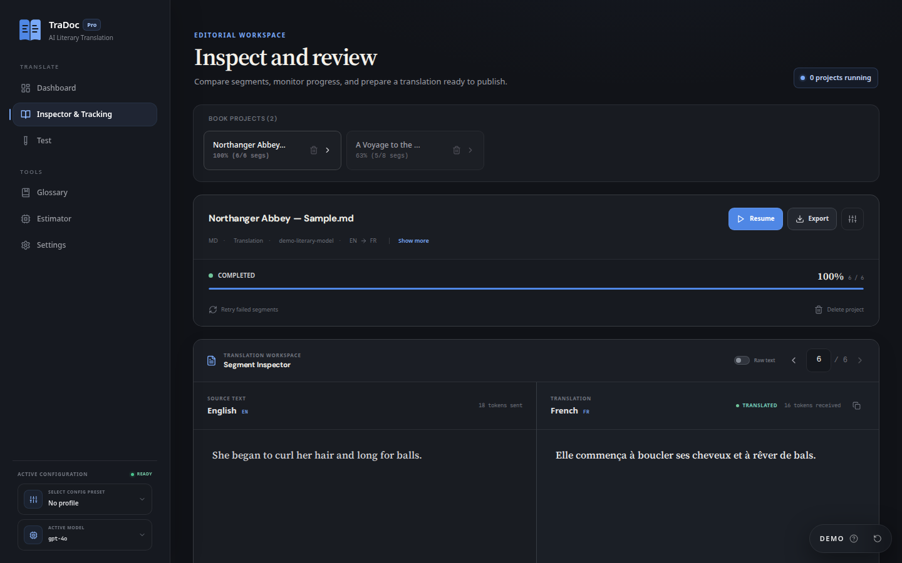

<div align="center">
  
  <h1>TraDoc</h1>
  <p><strong>A self-hosted workflow for translating long documents without losing structure, context, or control.</strong></p>

  <p>
    <a href="https://tradoc.lucas-homelab.fr"><strong>Website</strong></a> ·
    <a href="https://demo.tradoc.lucas-homelab.fr"><strong>Live demo</strong></a> ·
    <a href="https://docs.tradoc.lucas-homelab.fr"><strong>Documentation</strong></a>
  </p>

  <p>
    <a href="LICENSE"></a>
    
    
  </p>

  
</div>

## Overview

TraDoc is built for complete books and long-form documents rather than isolated text prompts. It extracts structured content, divides it into context-aware segments, coordinates local or remote language models, preserves progress in SQLite, and reconstructs an export that can be inspected before publication.

EPUB, PDF, DOCX, Markdown, and plain text share one project workflow with checkpoints, glossaries, provider control, parallel jobs, and a side-by-side segment inspector.

## Product preview

| Translation workspace | Editorial inspection |
| --- | --- |
| Import a document, choose languages, select a provider/model, and prepare or start the project. | Review source and translated segments, monitor progress, resume jobs, retry failures, and export. |
|  |  |

## Highlights

- Structured extraction and reconstruction for EPUB, PDF, DOCX, Markdown, and TXT.
- Semantic chunking with configurable context windows and output-token budgeting.
- Project-level model isolation for concurrent documents.
- Checkpointed, resumable jobs with automatic pause behavior when a provider fails.
- Glossaries for names, places, terminology, and project-specific rules.
- Side-by-side inspection, inline project configuration, progress tracking, and SSE updates.
- Provider profiles for local and remote OpenAI-compatible workflows.
- Reflowable EPUB export and an editorial 6×9 PDF reconstruction path.

## Quick start

### Docker Compose

Create `.env`:

```dotenv
APP_SECRET=replace-with-a-long-random-secret
LLM_ENDPOINT=http://host.docker.internal:1234/v1
LLM_API_KEY=replace-with-your-provider-key
LLM_MODEL=replace-with-your-model
```

Create `docker-compose.yml`:

```yaml
services:
  tradoc:
    image: ghcr.io/lucas-lepajollec/tradoc:latest
    container_name: tradoc
    restart: unless-stopped
    ports:
      - "127.0.0.1:2507:8000"
    environment:
      ENV: production
      DATA_DIR: /app/data
      APP_SECRET: ${APP_SECRET:?Define APP_SECRET in .env}
      LLM_ENDPOINT: ${LLM_ENDPOINT}
      LLM_API_KEY: ${LLM_API_KEY}
      LLM_MODEL: ${LLM_MODEL}
    volumes:
      - ./data:/app/data
    extra_hosts:
      - "host.docker.internal:host-gateway"
```

```bash
docker compose up -d
```

Open `http://127.0.0.1:2507`. The repository's Compose file builds the current checkout; the example above uses the published GHCR image.

### Local development

Requirements: Python 3.11+, Node.js 18+, and a local or remote model endpoint.

```bash
git clone https://github.com/lucas-lepajollec/tradoc.git
cd tradoc
cp .env.example .env
python -m venv .venv
./.venv/bin/python -m pip install -r requirements.txt
npm --prefix web ci
./.venv/bin/python main.py dev
```

On Windows, use `.\.venv\Scripts\python.exe` instead. Open `http://127.0.0.1:2499`.

Use `main.py dev --lan` only on a trusted network. On a shared network, configure an `APP_SECRET` of at least 24 characters and use `main.py dev --lan-secure`.

## Configuration and persistence

- `DATA_DIR` contains `tradoc.db`, provider configuration, checkpoints, source material, and generated exports.
- Back up the complete data directory before upgrades.
- Each project records its own model and configuration; changing the active dashboard preset does not silently rewrite existing projects.
- Provider credentials are server-side secrets stored in the private persistent volume and must never be committed.
- Local and remote provider profiles can target LM Studio, Ollama, vLLM, and other OpenAI-compatible endpoints.

Provider availability does not imply equal behavior or verified end-to-end translation quality.

## Security, privacy, and limitations

> [!WARNING]
> Do not expose TraDoc or a local inference endpoint directly to the public internet.

- Use a strong `APP_SECRET`, HTTPS, an authenticated reverse proxy, and appropriate firewall rules.
- Keep provider keys, source documents, outputs, and the SQLite database inside the protected volume.
- Keep `ALLOWED_ORIGINS` narrow when the frontend and API use different origins.
- Never solve permission errors with `chmod 777`; align ownership with the non-root container user.
- Validate concurrency against the provider; TraDoc cannot force an inference server to accept parallel requests.
- Structure preservation is a workflow guarantee, not a guarantee of literary quality.
- Legal, medical, technical, or publication-sensitive output requires human review.

Quality depends on the source document, parser behavior, model, prompt, glossary, context window, and editorial validation.

## Architecture

| Layer | Technology |
| --- | --- |
| Frontend | React 18, Vite, Tailwind CSS |
| API | FastAPI, Uvicorn, Python 3.11+ |
| Persistence | SQLite in WAL mode |
| Parsing | EbookLib, PyMuPDF, Beautiful Soup, lxml |
| Model access | Async HTTP client for local and remote providers |
| Deployment | Multi-stage Docker image |

```text
core/     # Parsers, chunking, checkpoints, glossary, and engine
api/      # FastAPI application and REST/SSE routes
web/      # React interface and isolated public demo
tests/    # Backend and security regression tests
main.py   # Development and server entry point
```

## Development and quality

| Command | Purpose |
| --- | --- |
| `python -m unittest discover -s tests` | Run backend, parser, checkpoint, engine, and security tests. |
| `npm --prefix web run build` | Build the production frontend. |
| `npm --prefix web run test:e2e` | Run the Playwright browser suite. |
| `npm --prefix web run check:demo` | Validate and build the isolated demo. |

The GitHub workflow runs backend tests, audits frontend dependencies, builds the UI, runs browser tests, and publishes the container only after validation.

## Public demo

The [public demo](https://demo.tradoc.lucas-homelab.fr) uses fictional projects and browser-only simulated actions. It connects to no AI server, stores no durable project, and sends no uploaded document to a backend. It demonstrates the workflow, not provider availability or translation quality.

## Documentation and community

- [Documentation](https://docs.tradoc.lucas-homelab.fr)
- [Contributing guide](CONTRIBUTING.md)
- [Changelog](CHANGELOG.md)
- [Code of Conduct](CODE_OF_CONDUCT.md)
- [Security policy](SECURITY.md)
- [MIT License](LICENSE)

Third-party libraries, model providers, and source documents retain their own licenses and terms.
